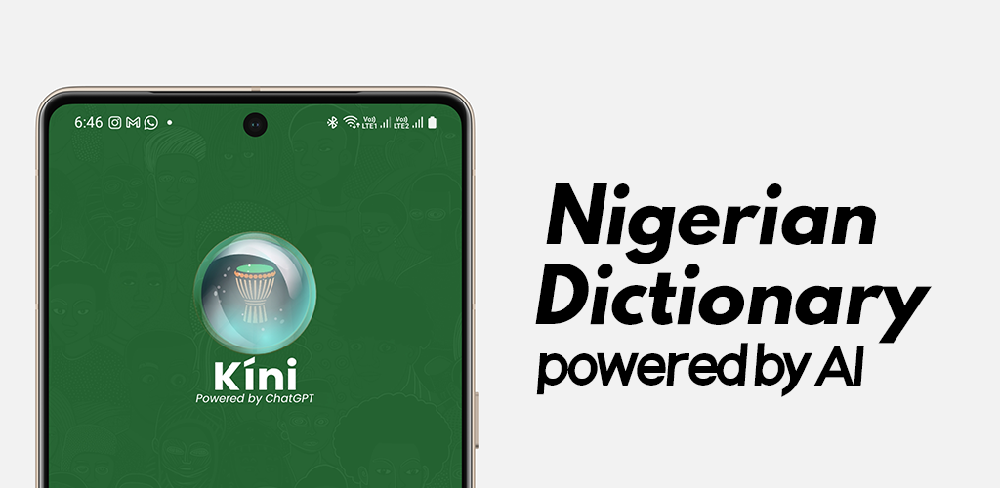
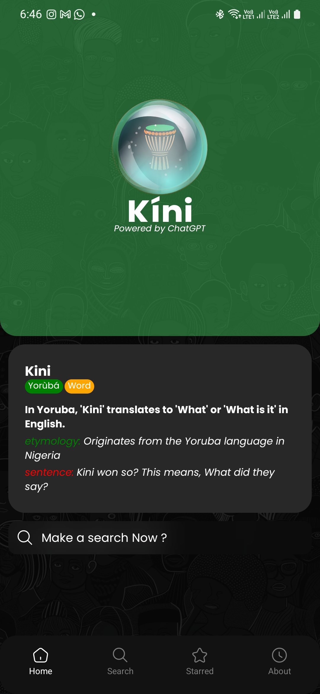
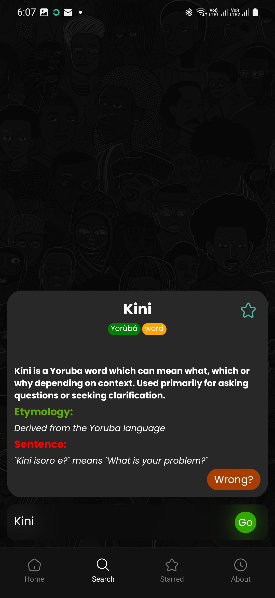

# Naija Dictionary - OpenAI
 

## Download

## Screenshots

    
    

    

## Description

Naija Dictionary is a mobile app that helps you learn Nigerian slangs and names. It uses the OpenAI API to generate slangs and names. It also uses the Echo framework to generate the API for the app.

## Tech Stack

- React Native
- OpenAI API
- Golang
- Echo
- PostgreSQL

## Installation

1. Clone the repo and run - <https://github.com/ElSierra/Nigerian-slang-and-names-go-openai>
2. Clone this -  <https://github.com/ElSierra/nigerian-dictionary-react-native>
3. Install dependencies - `npm install`
4. Run the app - `npm run android` or `npm run ios`
